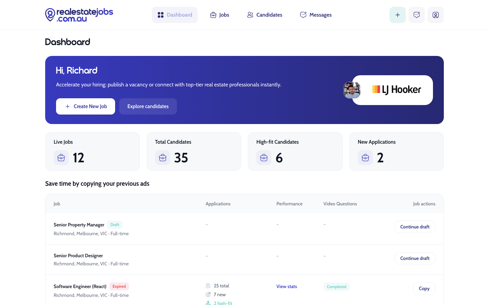
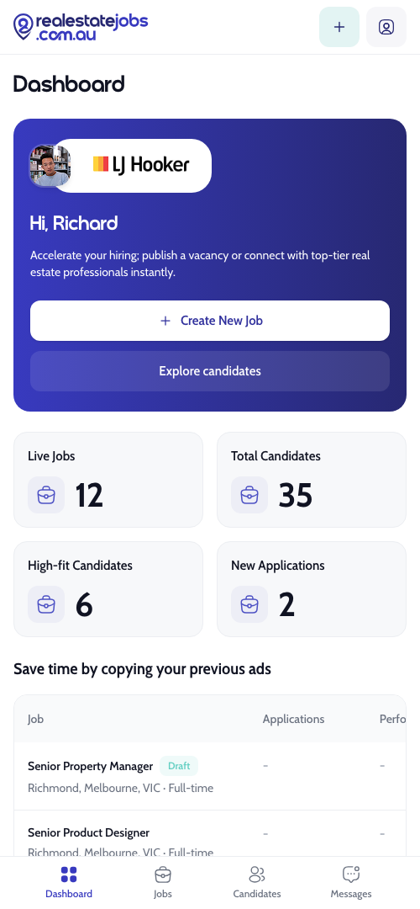

# realestatejobs.com.au — Employer App

The employer-facing side of realestatejobs.com.au: a recruiter workspace to track hiring stats, manage job ads, and move candidates through a hiring pipeline. Built to match a provided design.

## Screenshots

<table>
  <tr>
    <td align="center"><b>Desktop</b></td>
    <td align="center"><b>Mobile</b></td>
  </tr>
  <tr>
    <td></td>
    <td></td>
  </tr>
</table>

## Pages

| Route | Screen | Highlights |
| --- | --- | --- |
| `/` | **Dashboard** | Welcome banner, KPI stat cards, "copy previous ads" table |
| `/jobs` | **Jobs** | Active / Draft / Archive tabs, jobs table with per-row actions |
| `/candidates` | **Candidate Management** | Role sidebar + pipeline stages; **drag a candidate onto a stage** to move them |
| `/messages` | placeholder | — |

Navigation is a top bar on desktop and a fixed bottom tab bar on mobile.

## Tech stack

- **React 19** + **TypeScript**
- **Vite 6** (dev server & build)
- **React Router 7** — client-side routing with a shared layout
- **Tailwind CSS v4** — CSS-first config via `@theme` (no `tailwind.config.js`)
- **@dnd-kit/core** — drag-and-drop for the candidate pipeline
- **iconsax-react** — icon set (Linear/Bold variants)
- **tailwind-merge** — conflict-safe class merging in `cn()`

## Getting started

```bash
npm install
npm run dev      # start the dev server (http://localhost:5173)
npm run build    # type-check + production build to dist/
npm run preview  # preview the production build
```

## Project structure

```
src/
  main.tsx              App entry
  App.tsx               Router + routes
  index.css             Tailwind import + @theme design tokens + @font-face
  pages/
    Dashboard.tsx       KPI stats + previous-ads table
    Jobs.tsx            Job listings with tabs
    Candidates.tsx      Candidate pipeline (drag-and-drop)
    Placeholder.tsx     "Coming soon" stub for unbuilt routes
  components/
    layout/
      Layout.tsx        Navbar + <Outlet>
      Navbar.tsx        Top nav (desktop) + bottom tab bar (mobile)
    dashboard/          WelcomeBanner, StatCard, JobsTable, ApplicationsCell
    jobs/               JobsTable (listing + row actions)
    candidates/         RoleList, CandidateCard
    ui/                 Reusable primitives
      Button, Badge, Card, IconButton, Text
      icons.tsx           iconsax wrappers + custom SVG icons
      cn.ts               className merge helper (tailwind-merge)
      index.ts            barrel export
  data/mockData.ts      Mock content (user, nav, stats, jobs, roles, candidates)
  types/index.ts        Shared TypeScript types
public/
  logo.svg, favicon.svg, avatar.png, ljhooker-logo.png
  fonts/                Self-hosted Cabin (body) + Tanod (display)
```

## Design system

- **Tokens** — all colors and radii live as `@theme` variables in `src/index.css` (brand ramp, hero gradient, semantic status colors, neutrals, nav/icon surfaces, radii). Change the scheme from one place.
- **Fonts** — self-hosted and preloaded to avoid layout shift: **Tanod** for display/headings, **Cabin** for body text.
- **Components** are variant-driven (e.g. `Button` variant/size, `Badge` variant, `Text` variant/tone/weight) and consume tokens rather than hardcoded colors.

## Notes

- **Data is mocked** in `src/data/mockData.ts`; page/card action handlers currently log to the console — wire them to real data/APIs as needed. Candidate pipeline changes (drag-and-drop) update in-memory state.
- **iconsax + React 19**: iconsax sets defaults via legacy `defaultProps` (ignored by React 19), so every icon is re-exported through a small wrapper in `src/components/ui/icons.tsx` that supplies `color`/`size`/`variant`. Import icons from there, not directly from `iconsax-react`.
- **Deploying to a sub-path** (e.g. GitHub Pages project site): set Vite's `base`, make the absolute asset paths base-aware, and give the router a matching `basename`.
